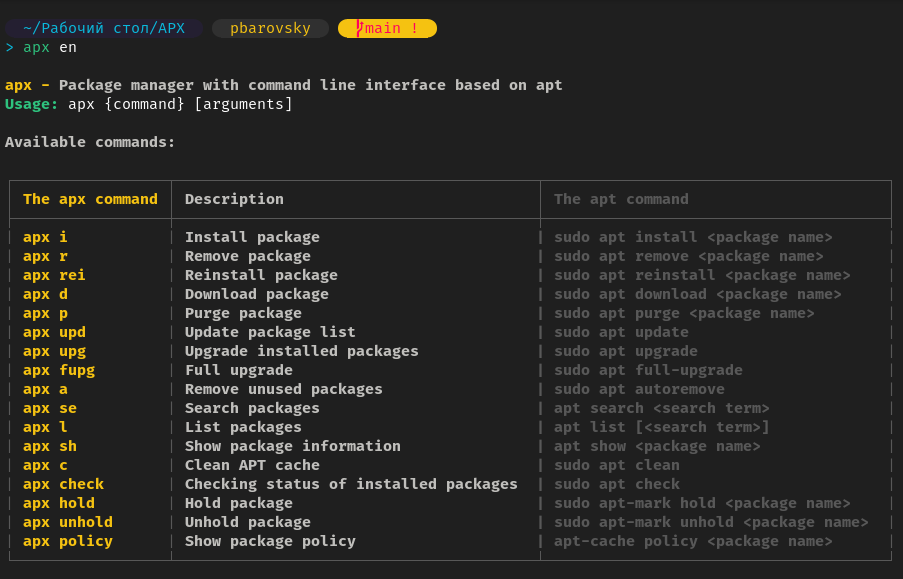

# APX - Alias Package Manager

APX is a command-line interface (CLI) package manager based on `apt`, specifically designed for Ubuntu-based distributions. It provides an intuitive alias system to simplify the process of managing packages.

## Features
- Simplifies APT commands with easy-to-remember aliases.
- Covers essential operations like installing, removing, updating, and managing packages.
- Built-in multilingual help system.

---

## Installation
To install APX, run the following commands in your terminal:

```bash
git clone https://github.com/pbarovsky/APX.git
```

```bash
cd APX
```

```bash
chmod +x install_apx.sh
./install_apx.sh
```

---

## How It Works

APX translates its commands into corresponding APT commands, making it easier to handle package management with shorter, user-friendly aliases.

---

## Available Commands

| APX Command   | Description                               | Equivalent APT Command                  |
|---------------|-------------------------------------------|------------------------------------------|
| `apx i`       | Install a package                        | `sudo apt install <package>`            |
| `apx r`       | Remove a package                         | `sudo apt remove <package>`             |
| `apx rei`     | Reinstall a package                      | `sudo apt reinstall <package>`          |
| `apx d`       | Download a package                       | `sudo apt download <package>`           |
| `apx p`       | Purge a package                          | `sudo apt purge <package>`              |
| `apx upd`     | Update package list                      | `sudo apt update`                       |
| `apx upg`     | Upgrade installed packages               | `sudo apt upgrade`                      |
| `apx fupg`    | Full upgrade                             | `sudo apt full-upgrade`                 |
| `apx a`       | Remove unused packages                   | `sudo apt autoremove`                   |
| `apx se`      | Search for packages                      | `apt search <search term>`              |
| `apx l`       | List available or installed packages      | `apt list [<search term>]`              |
| `apx sh`      | Show package information                 | `apt show <package>`                    |
| `apx c`       | Clean the APT cache                      | `sudo apt clean`                        |
| `apx check`   | Check the status of installed packages   | `sudo apt check`                        |
| `apx hold`    | Hold a package to prevent updates        | `sudo apt-mark hold <package>`          |
| `apx unhold`  | Unhold a package                         | `sudo apt-mark unhold <package>`        |
| `apx policy`  | Display package version and priority     | `apt-cache policy <package>`            |

---

## Demonstrations

### Installing and removing package with APX


---

## Help
To view the help menu:

- **English help**

```bash
apx en
```

- **Russian help**

```bash
apx ru
```

The help menu provides detailed information about all available commands.


---

## Contributing
Feel free to contribute by submitting pull requests or reporting issues in the GitHub repository. Your feedback and contributions are appreciated!